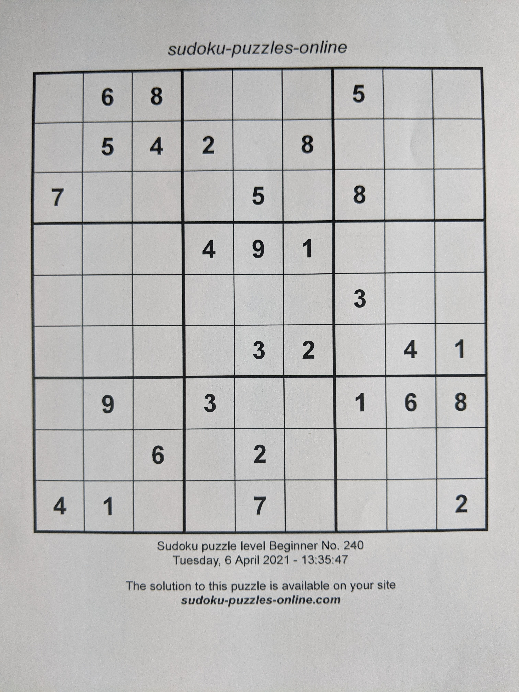
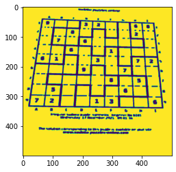
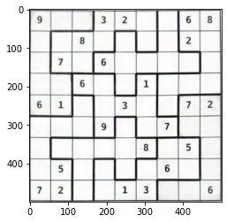
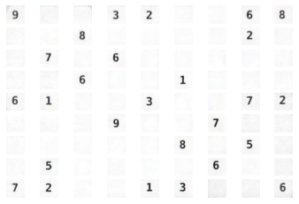

# Proiect 1 CAVA - Moroianu Theodor - 334

## Ce Taskuri Am Implementat

Am implementat cele doua taskuri de recunoastere a sudoku-ului, taskul de detectare a muchiilor groase de la jigsaw, si taskul de OCR (digit recognition).

## Obtinerea Patratului Sudoku

Prima dificultate a proiectului este obtinerea patratului sudoku din poza.




Vom efectua urmatorii pasi:

 * Aplicam diferite filtre, pentru a evidentia conturul:\
    
 * Izolam conturul maximal, dupa care efectuam o schimbare de perspectiva:
    

## Obtinerea digit-urilor

A doua dificultate este izolarea digiturilor.
Avand poza pusa in perspectiva patratului sudoku, putem, atat pentru jigsaw cat si pentru clasic sa izolam patratelele, lasand un mic offset pentru a nu include border-ul:



Este suficient sa aplicam acum o retea de tip clasificare OCR, care ne poate da 10 predictii diferite:
 * `0` daca nu se afla niciun digit in casuta respectiva.
 * `d` daca in casuta respectiva sa gaseste digit-ul `d`.

Trebuie notat ca nu pre-procesez digit-urile inainte sa le trec prin retea, pentru ca ar da o acuratete mai scazuta. Motivul principal este ca luminozitatea si contrastul pot varia mult intre poze, si deci pre-procesarile pot degrada calitatea acestora.

## Obtinerea Unui Digit Dataset

Pentru a avea suficiente date pentru a imi antrena o retea neuronala, am folosit:

 * Un dataset, disponibil public [aici](https://www.kaggle.com/kshitijdhama/printed-digits-dataset/version/10).
 * Digiturile extrase din primele `15` poze clasice si primele `30` de poze jigsaw.

Motivul pentru acest dataset mixt este:

 * Datasetul de pe Kaggle contine multe digit-uri cu diferite fonturi / dimensiuni, si ajuta la prevenirea overfittingului, fara sa necesite o invatare redundanta a unor date care nu apar la test.
 * Datasetul din digit-uri este constituit din exact acelasi tip de imagini ca cele de la test time.
 * Nu antrenez pe toate imaginile date, pentru a putea valida acuratetea retelei pe ultimele `5`, respectiv `10` imagini clasic si jigsaw.

## Extragerea Bordurii Jigsaw

Pentru a extrage bordura jigsaw, am urmatoarea abordare:

1. Trec patratul jigsaw prin niste filtre de threshold binar si eroziune, pentru a evidentia bordurile.
2. Definesc _intensitatea_ unei borduri ca fiind suma pixelilor din acea regiune.
3. Implementez algoritmul de `Union-Find`, numit in romana `Paduri de multimi disjuncte`, prin care incerc sa unesc multimea de patratele in ordinea `intensitatii` muchiilor alaturate, refuzand sa unesc doua patratele daca:

    * Cele doua componente sunt deja maximale (au dimensiunea `9`). In cazul acesta, muchia este gasita ca fiind una groasa, si cele subtiri au fost deja unite.
    * Suma celor doua componente ar fi mai mare de `9`. In acest caz, muchia este una groasa, care este in mod incorect detectata ca fiind mai subtire ca alte muchii mai mici.\

    Avantajul acestui algoritm este ca:
     * Nu necesita sa clasificam muchiile ca subtiri sau groase, este suficient sa putem suficient de bine sa le ordonam.
     * Chiar daca ordonarea nu este corecta, cu o probabilitate foarte mare zonele o sa fie delimitate corect.

## Rezolvarea Sudoku Clasic

Codul care rezolva sudoku-ul clasic este urmatorul:

```Python
def process_classic(image: np.ndarray) -> List[List[int]]:
   # extragem patratul
   square = sq_extractor.extract_square_from_image(image)
   # extragem digiturile
   small_sq = u_sq_extractor.extract_unit_squares(square)
   # efectuam OCR
   digits = [[ocr.recognize_digit(small_sq[i][j]) for j in range(9)] for i in range(9)]
   return digits
```

## Rezolvarea Jigsaw

Codul care rezolva jigsaw este urmatorul:

```Python
def process_jigsaw(image: np.ndarray) -> Tuple[List[List[int]], List[List[int]]]:
   # extragem patratul
   square = sq_extractor.extract_square_from_image(image)
   # extragem digiturile
   small_sq = u_sq_extractor.extract_unit_squares(square)
   # facem OCR
   digits = [[ocr.recognize_digit(small_sq[i][j]) for j in range(9)] for i in range(9)]

   # extragem adiacenta intre patratele, ordonata dupa grosime
   l = u_sq_extractor.adjancy_by_edge_strength(square)

   # unim in functie de grosime
   unionfind = uf.UnionFind()
   for (x1, y1), (x2, y2) in l:
      id1 = unionfind.to_id(x1, y1)
      id2 = unionfind.to_id(x2, y2)
      unionfind.join(id1, id2)

   # obtinem culoarea fiecarei zone
   rez = unionfind.compute_classes()

   return digits, rez
```

## Implementare

Implementarea proiectului este impartita in module:

 * `constants.py` salveaza constante folosite de-a lungul proiectului.
 * `data_generator.py` genereaza training-data-ul pentru retea.
 * `ocr.py` efectuaza recunoasterea digiturilor, si antrenarea retelei daca modelul nu este gasit pe disc.
 * `process_sudoku.py` proceseaza poza unui sudoku, apeland celelalte module.
 * `solver.py` este entry-point-ul proiectului.
 * `square_extractor.py` extrage dintr-o poza patratul sudoku.
 * `union_find.py` efectueaza algoritmul de UnionFind, asa cum am descris mai sus.
 * `unit_square_extractor.py` extrage dintr-un patrat imaginile digit-urilor.

## Rezultate Pe Training

Proiectul functioneaza perfect pe datele de antrenare, avand o acuratete de 100% atat pe taskul 1 si taskul 2 cat si pe bonus.
